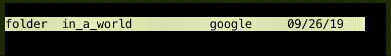

# Cloud
Command-line access to your files across major cloud service accounts. Currently works with Google Drive, OneDrive, Box, and Dropbox. Implemented such that new services (Python API required) can easily be incorporated in the future.

# Demo

# Features

### Upload this

### Delete that

### Download things

### Search it

### Storage summary

